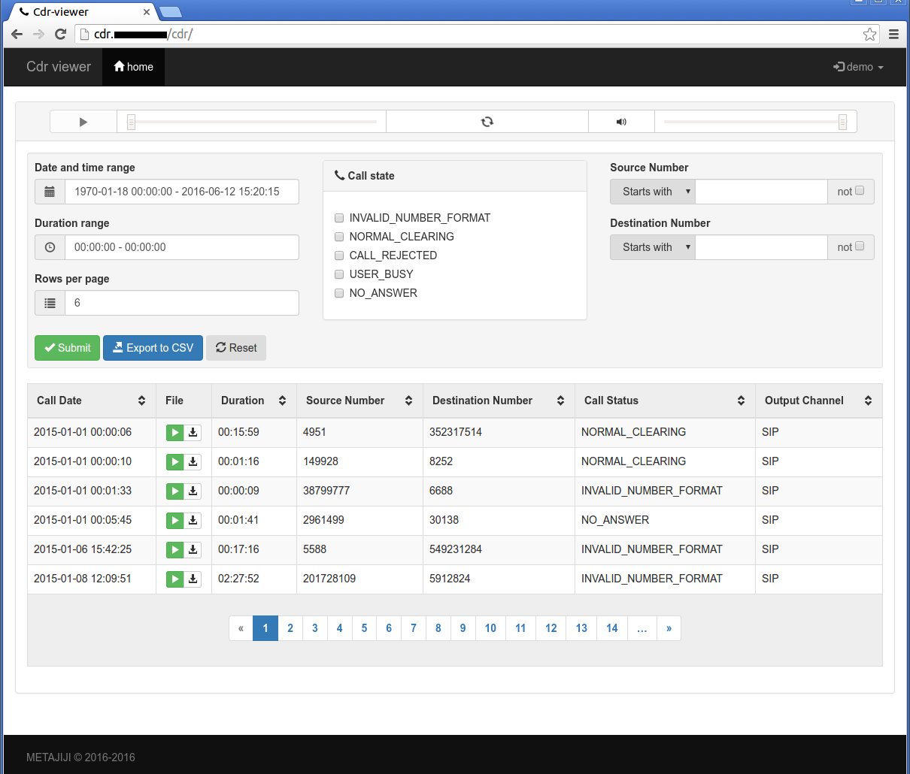
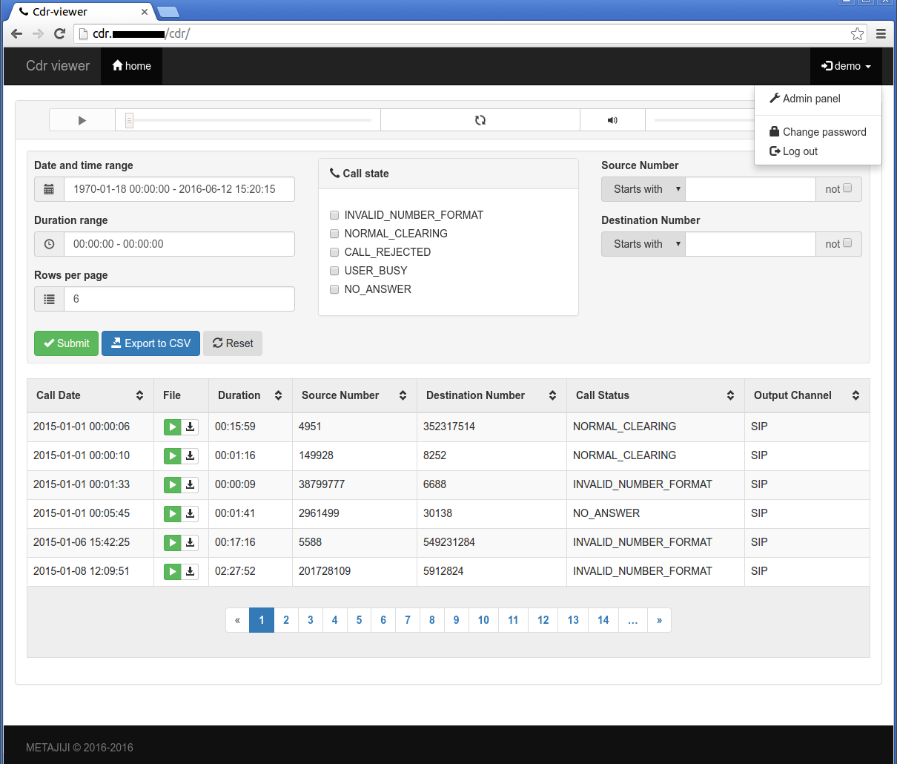
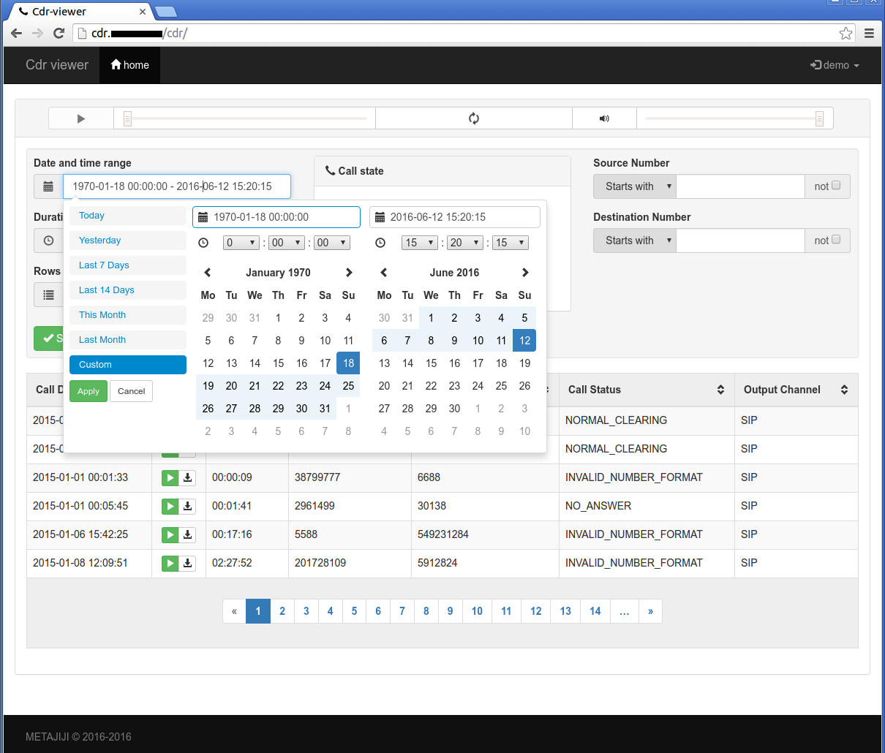

# PREVIEW IMAGES








# DEVELOPMENT

## Initial create project:

```bash
virtualenv -p python2 --prompt="(cdr-viewer)" venv
. venv/bin/activate
pip install --upgrade pip
django-admin startproject cdr .
python manage.py migrate
python manage.py createsuperuser
python manage.py collectstatic
```

## Migrations

### If `models.py` was chenged, run again:

```bash
python manage.py makemigrations cdr
python manage.py migrate
```

### Apply migrations

```
python manage.py migrate --database pbx cdr
```

## Custom admin

### Create custom admin area for manage users:
```bash
django-admin.py startapp customuseradmin
```
#### Code `customuseradmin/admin.py`:
```
# -*- coding:utf-8 -*-
from django.contrib import admin
from django.contrib.auth.models import User, Group
from django.contrib.auth.admin import UserAdmin

admin.site.unregister(User)

class CustomUserAdmin(UserAdmin):
    list_display = ('username', 'email', 'is_staff','is_active',)
    list_filter = ('is_staff', 'is_superuser', 'is_active',)
admin.site.register(User, CustomUserAdmin)
```

## Test **SMTP** Email Server

### Run server:
```bash
python -m smtpd -n -c DebuggingServer localhost:1025
```

## Localization

### Use django way (rocommended)

#### Initial generate from python code and templates files:

```bash
. venv/bin/activate
cd cdr
[ -d locale ] || mkdir locale
python ../manage.py makemessages --locale=ru_RU --no-location
python ../manage.py compilemessages --locale=ru_RU
```

#### Update from python code and templates files:

```bash
. venv/bin/activate
cd cdr
python ../manage.py makemessages --locale=ru_RU --no-location
python ../manage.py compilemessages --locale=ru_RU
```

### If you get error like this, then you need install `gettext` package
```
python ../manage.py makemessages --locale=ru_RU --no-location
CommandError: Can't find msguniq. Make sure you have GNU gettext tools 0.15 or newer installed.
```

#### like this for fix error

```
sudo apt install gettext
```

### Or use native os tools (not recommended)
```bash
find accounts/locale -name *.po | sed 's/\.po$//g' | xargs -i{} msgfmt {}.po -o {}.mo
```

## Git delete unwanted file from repo

`Be careful! This will overwrite your existing tags.`
```
git filter-branch --force --index-filter \
'git rm --cached --ignore-unmatch cdr/settings.py' \
--prune-empty --tag-name-filter cat -- --all
```

# LINKS

## Django translation
* https://docs.djangoproject.com/en/1.9/topics/i18n/translation/

## Media files
* http://stackoverflow.com/questions/8600843/serving-large-files-with-high-loads-in-django
* https://toster.ru/q/208755
* http://csscompressor.com/
* http://wiki.nginx.org/XSendfile
* https://www.nginx.com/resources/wiki/start/topics/examples/xsendfile/
* https://djangosnippets.org/snippets/2728/

### Additional headers for Nginx:

```
X-Accel-Limit-Rate: 1024
X-Accel-Buffering: yes|no
X-Accel-Charset: utf-8
```

### Note that the following HTTP headers aren't modified by NGINX:

```
Content-Type
Content-Disposition
Accept-Ranges
Set-Cookie
Cache-Control
Expires
```

>`/media_nginx/` cant be equal `/media/`, because `/media_nginx/` is internal and
> nginx not accept request from external network from users
> nginx will be accep only internal responses from backed application

## 3rdparty components
* http://mottie.github.io/tablesorter/docs/
* https://cdnjs.com/libraries/jquery.tablesorter
* https://github.com/iainhouston/bootstrap3_player
* https://github.com/dangrossman/bootstrap-daterangepicker
* http://www.daterangepicker.com/
